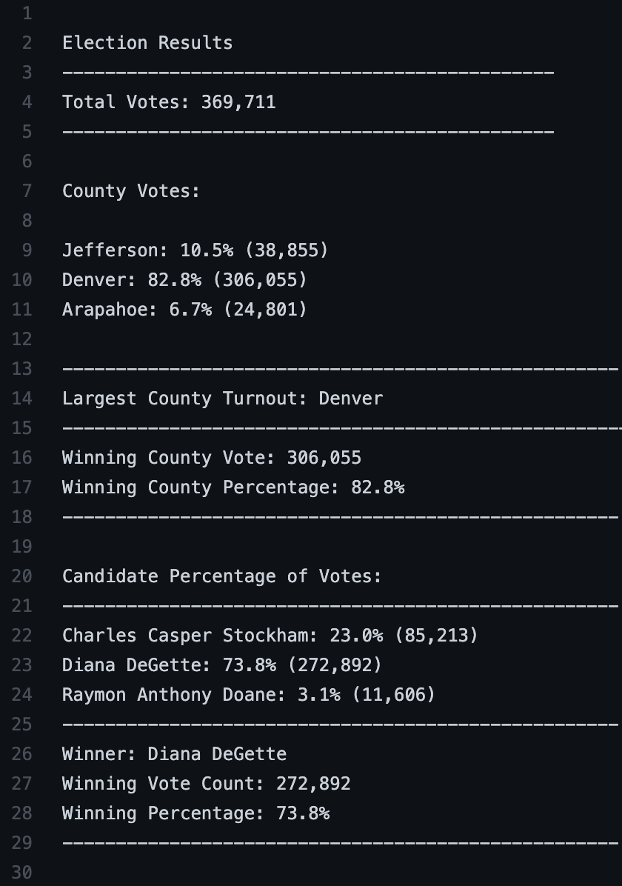

# **Election_Analysis**

## ***Project Overview***
A Colorado Board of Elections employee has given you the following tasks to complete the election audit of a recent local congressional election.

1. Calculate the total number of votes cast.
2. Get a complete list of candidates who received votes.
3. Calculate the total number of votes each candidate received.
4. Calculate the percentage of votes each candidates won.
5. Determine the winner of the election based on popular vote.

## ***Resources***
- Data Sources: election_results.csv
- Software: Python 3.6.1, Visual Studio Code 1.56.2 
[Note: Python open source provides guides where to look for more information:](https://pythonguides.com/category/python-tutorials/)

## **Analysis and Challenges**
This project analyses a dataset that collects the information of an election in the Colorado state. The includes the following aspects:
- Total number of votes cast
- A complete list of candidates who received votes
- Total number of votes each candidate received
- Percentage of votes each candidate won
- The winner of the election based on popular vote
- Total number of votes each county.
- Largest county turnout

### Challenge behind
The module helps us to overview the step-by-step of coding that was prepare to calculate the election audit task. We use ***pseudocode*** writing which is a technique that commonly programmers use to audit easier a program :+1:

## ***Summary***
The analysis of the election show that:
**There were "369,711" votes cast in the election.**

- The candidates were:
    - Charles Casper Stockham
    - Diana DeGette
    - Raymon Anthony Doane
- The counties to be analyzed:
    - Jefferson
    - Denver
    - Arapahoe
- The candidate results were:
    - Charles received "23.0%" of the vote and "85,213" number of vote.
    - Diana received "73.8%" of the vote and "272,892" number of vote.
    - Raymon received "3.1%" of the vote and "11,606" number of vote.
- The counties results were:
    - Jefferson county received "10.5%" of the vote and "38,855" number of vote.
    - Denver county received "82.8%" of the vote and "306,055" number of vote.
    - Raymon county received "6.7%" of the vote and "24,801" number of vote.
    
- The winner of the election was:
    - Diana DeGette, who received "73.8%" of the vote and "272,892" total number of votes.
- The largest county turnout was:
    - Denver that received "82.8%" of the votes and "306,055" total number of votes.
    
    **RESULTS FOUNDED IN THE AUDIT DATASET**

    
## ***Challenge Overview***
The module helped to undertand the coding blocks by describing the qualities of each topic. However, the complexity was high level which encourage to study the semantic of program.

## ***Challenge Summary***
Open files, create variables and connect them through for loops and other conditionals, are tools that require practice while using Python in a IDE.

